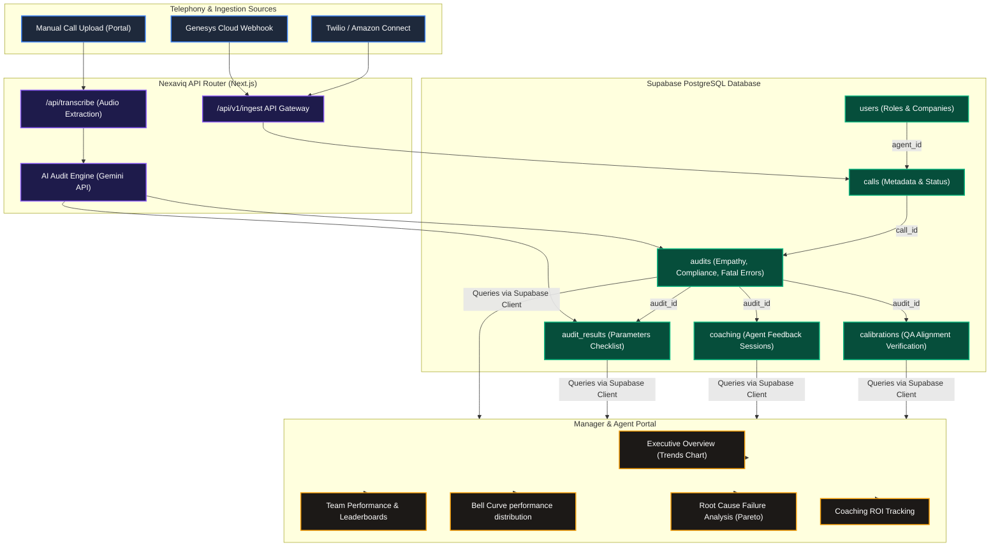

# Nexaviq Platform Architecture Diagram

Below is the complete system and data flow diagram for the **Nexaviq** platform. You can copy the code block below or render it to preview.

### How to use this diagram:
1. **GitHub/GitLab**: When you commit this markdown file, GitHub will automatically render it as an interactive visual diagram.
2. **Mermaid Live Editor**: You can copy-paste the code inside the block directly into [Mermaid Live Editor](https://mermaid.live/) to export it as a high-quality PNG, SVG, or PDF document for presentations.
