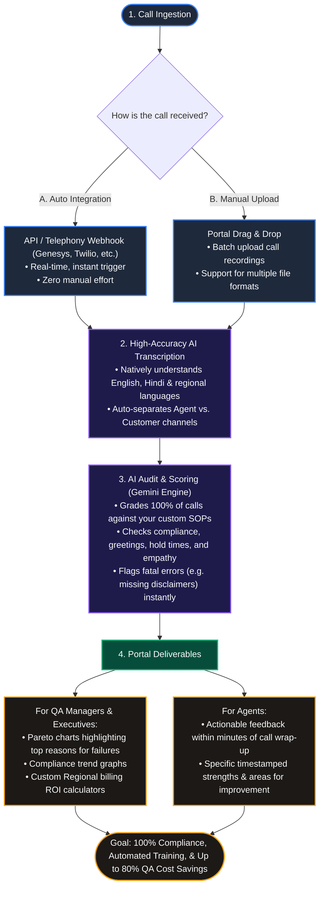

# Nexaviq Vendor Pitch Flowchart

This flowchart is designed for you to share with BPO vendors, call center managers, and enterprise stakeholders. It explains the step-by-step business value and operational process of **Nexaviq**.



### How to use this flowchart for your pitch:
1. **VS Code / Markdown Viewer**: Open this file (`vendor_flowchart.md`) in your editor to preview the visual diagram.
2. **Export as Image**: 
   * Copy the code block starting with ````mermaid` and ending with ````.
   * Go to **[mermaid.live](https://mermaid.live/)**.
   * Paste the code on the left pane.
   * Under the diagram on the right, click **Actions -> Copy PNG** or **SVG** to download an image file you can insert directly into your pitch decks, PDF documents, or emails to vendors.
